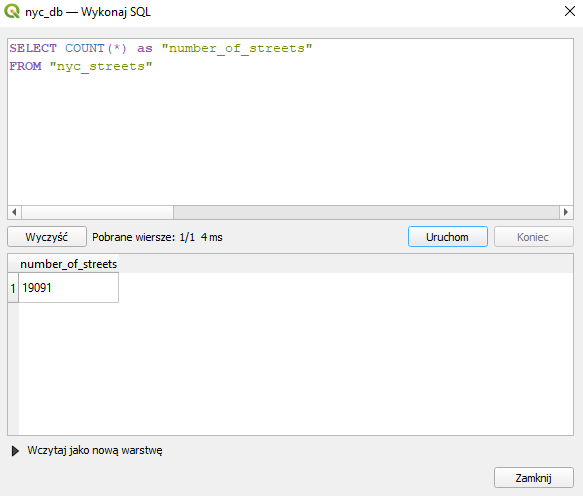
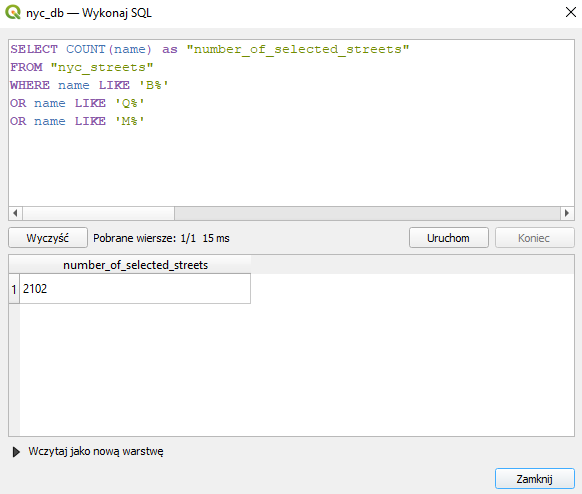
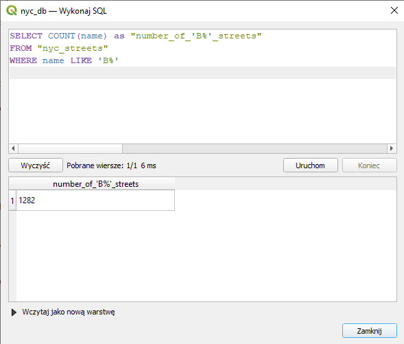
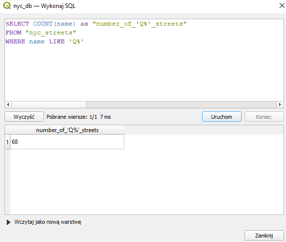
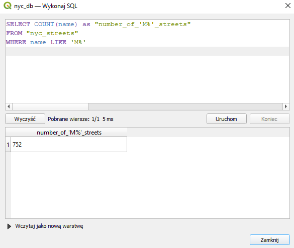
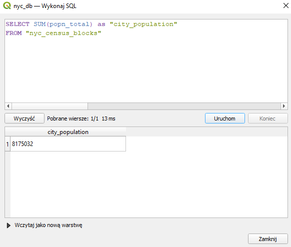
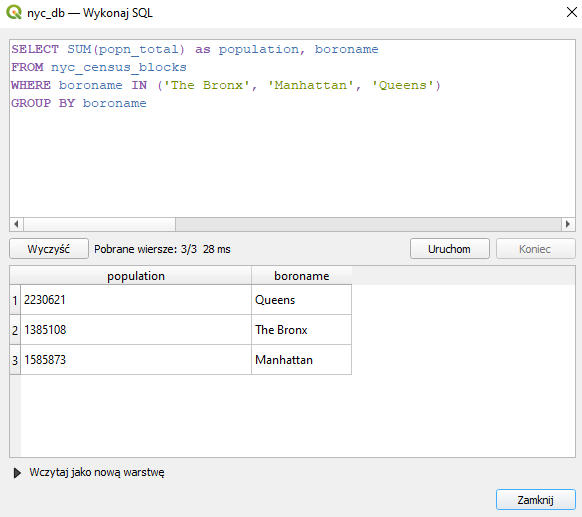
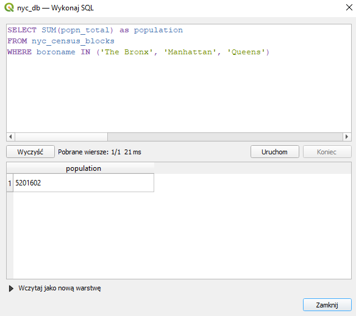
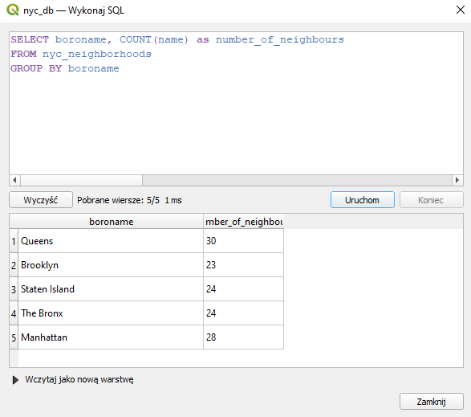

### 1. Ile rekordów znajduje się w tabeli nyc_streets?  
SQL:  
	SELECT COUNT(*) as "number_of_streets"   
	FROM "nyc_streets"  
  
Answer:	19091  
  
  
  
### 2. Ile ulic w Nowym Jorku ma nazwy zaczynające się na „B”, „Q” i „M”?  
SQL:  
	SELECT COUNT(name) as "number_of_selected_streets"  
	FROM "nyc_streets"   
	WHERE name LIKE 'B%'  
	OR name LIKE 'Q%'  
	OR name LIKE 'M%'  
  
Answer: w sumie - 2102  
	na B - 1282  
	na Q - 68  
	na M - 752  
  
  
  
  
  
  
### 3. Jaka jest populacja miasta Nowy Jork?  
SQL:   
	SELECT SUM(popn_total) as "city_population"  
	FROM "nyc_census_blocks"  
  
Answer: 817502  
  
  
  
### 4. Jaka jest populacja Bronxu, Manhattanu i Queens?  
SQL:  
	SELECT SUM(popn_total) as population, boroname  
	FROM nyc_census_blocks  
	WHERE boroname IN ('The Bronx', 'Manhattan', 'Queens')  
	GROUP BY boroname  
  
   dla sumy:  
	SELECT SUM(popn_total) as population  
	FROM nyc_census_blocks  
	WHERE boroname IN ('The Bronx', 'Manhattan', 'Queens')  
  
Answer: w sumie 	5201602  
	The Bronx	1385108  
	Manhattan	1585873  
	Queens		2230621  
  
  
  
  
### 5. Ile dzielnic ("neighborhoods") znajduje się w każdej gminie (borough)?  
SQL:  
	SELECT boroname, COUNT(name) as number_of_neighbours  
	FROM nyc_neighborhoods  
	GROUP BY boroname  
  
Answer:   
	Queens		30  
	Brooklyn	23  
	Staten Island	24  
	The Bronx	24  
	Manhattan	28  
  